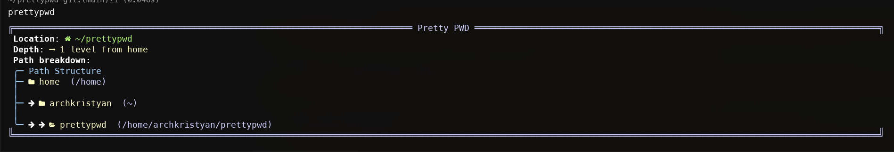
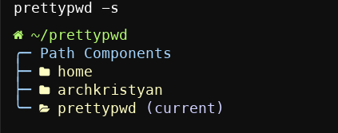

# PrettyPWD

A prettier alternative to the standard 'pwd' command, providing enhanced visual representation of your current working directory with path breakdown and depth information.



## Features

- **Enhanced Path Display**: Shows your current working directory with improved formatting
- **Path Depth**: Indicates how many directories deep you are from your home directory
- **Path Breakdown**: Visualizes each directory in the path separately
- **Dual Modes**: 
    - Detailed mode (default): Full path breakdown with icons
    - Simple mode: Cleaner, more compact output
- **Nerd Font Icons**: Uses icons for better visual representation

## Requirements

- A Unix-like operating system (Linux, macOS, WSL)
- Bash or compatible shell
- [Nerd Font](https://www.nerdfonts.com/) installed and configured in your terminal (for optimal visual experience)

## Installation

1. Clone the repository:
```bash
git clone https://github.com/kristyancarvalho/prettypwd.git
```

2. Navigate to the prettypwd directory:
```bash
cd prettypwd
```

3. Make the script executable:
```bash
chmod +x prettypwd.sh
```

4. Add the script to your PATH or create an alias in your shell configuration file (e.g., .bashrc, .zshrc):
```bash
# Add to PATH example
export PATH="$PATH:/path/to/prettypwd"

# OR create an alias
alias ppwd='/path/to/prettypwd/prettypwd.sh'
```

5. Reload your shell configuration:
```bash
source ~/.bashrc  # or source ~/.zshrc for Zsh users
```

## Usage

### Basic Usage

Simply run the command in your terminal:

```bash
ppwd  # If you set up an alias
# OR
prettypwd.sh  # If you added to PATH
```

### Command Options

- **Detailed Mode** (default):
```bash
ppwd
```

- **Simple Mode**:
```bash
ppwd -s
# OR
ppwd --simple
```

## Examples

### Detailed Mode Output


*The detailed mode shows each directory in your path with icons and full path breakdown.*

### Simple Mode Output



*The simple mode provides a cleaner, more compact representation of your current path.*

## Customization

You can modify the script to change icons, colors, and formatting based on your preferences. Open the `prettypwd.sh` file in your favorite text editor and look for the configuration section.

## Contributing

Contributions, issues, and feature requests are welcome! Feel free to check the [issues page](https://github.com/kristyancarvalho/prettypwd/issues).

